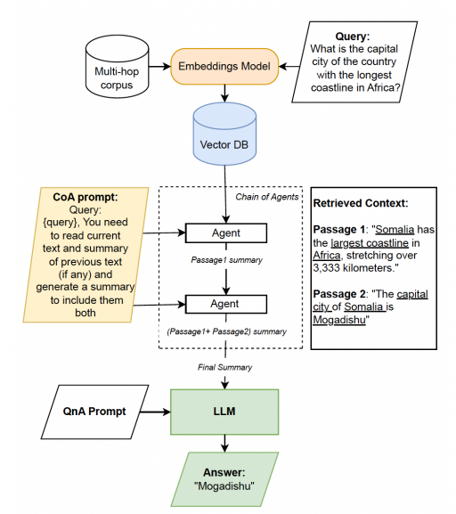
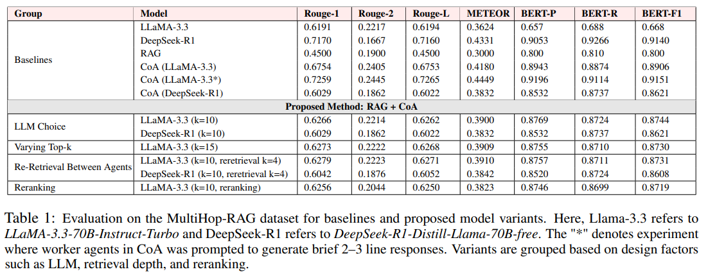

# Multi-Hop reasoning with RAG and Chain-of-Agents

Traditional Retrieval-Augmented Generation (RAG) pipelines struggle with multi-hop reasoning due to retrieval noise, missing intermediate facts, and difficulty in integrating dispersed information across documents. 

While the `Chain-of-Agents (CoA)` framework enhances reasoning through sequential information processing, it typically requires processing the entire corpus, which limits its scalability in real world settings. 

To address these challenges, we propose a hybrid framework that builds upon RAG by incorporating a `CoA-style reasoning module`. Our system uses a semantic retriever to extract relevant evidence, which is then processed iteratively to distill and integrate critical information before generating a final answer. This structured approach reduces irrelevant content and improves factual consistency. 

Evaluated on the MultiHop-RAG dataset, our method demonstrates significant improvements in reasoning coherence and answer accuracy over baseline RAG systems.

For more details refer to Final report in `docs/`

## Architecture



Our proposed solution is structured around four key stages: embedding and indexing the document corpus, retrieving passages semantically similar to the query, performing iterative reasoning through the CoA module, and generating the final answer using an LLM.

## Dataset - MultiHopRAG

Located in `experiments/multiHopRag-dataset/`:

| File | Description |
|------|-------------|
| `corpus.json` | 609 news articles, each with `title`, `body`, `author`, `source`, `published_at`, `category`, `url` |
| `MultiHopRAG.json` | 2,556 multi-hop queries, each with `query`, `answer`, `question_type`, and `evidence_list` (gold document titles) |

Questions span four types: `inference_query`, `comparison_query`, `temporal_query`, `null_query`. Answering each requires reasoning across ≥2 documents.

To print dataset statistics:
```bash
python dataset_info.py
```
---
## Results



For more detailed explanation of results, refer to the report in `docs`

## Setup

```bash
pip install -r requirements.txt
```

Create a `.env` file in the repo root (already gitignored):
```env
TOGETHERAI_API_KEY=
QUADRANT_DB_URL=
QUADRANT_API_KEY=
KINDO_API_KEY=
DEEPINFRA_API_KEY=
```

---

## Baselines

#### 1. LLaMA Full-Context (`experiments/baselines/LLama/llm_llama32.py`)

Sends each query with its complete gold-evidence documents as context to a LLaMA model. No retrieval involved.

```bash
cd experiments/baselines/LLama

# Run inference with Together.AI free model (default)
python llm_llama32.py --mode togetherai_free

# Run inference with DeepInfra
python llm_llama32.py --mode deepinfra

# Run a subset of queries (e.g. first 100)
python llm_llama32.py --mode togetherai_free --start 0 --end 100 --output results_100.json
```

Output: `results.json` — list of `{query, gold, pred}`.

---

#### 2. RAG + LLM (`experiments/baselines/RAG/rag.py`)

Indexes the corpus into Qdrant, retrieves top-10 chunks per query, then runs an LLM over retrieved context.

```bash
cd experiments/baselines/RAG

# Step 1: Index corpus into Qdrant + retrieve for all queries
python rag.py --mode index_retrieve

# Step 1b: Skip indexing (already done), just retrieve
python rag.py --mode retrieve

# Step 2a: Run QA with Kindo (llama3-70b-8192) over retrieval output
python rag.py --mode qa_kindo

# Step 2b: Run QA with GPT-4o over retrieval output
python rag.py --mode qa_gpt4o
```

Key options: `--corpus`, `--queries`, `--retrieval_output`, `--qa_output`, `--chunk_size`, `--collection`.

---

#### 3. Chain-of-Agents on Gold Context (`experiments/baselines/CoA/chainofagents.py`)

Splits gold-evidence documents into chunks and runs a worker–manager CoA pipeline. No retrieval, uses ground-truth evidence.

```bash
# Run from repo root
python experiments/baselines/CoA/chainofagents.py \
  -r experiments \
  -o coa_output \
  -c 1500 \
  -m meta-llama/Llama-3.3-70B-Instruct-Turbo-Free
```

| Flag | Description |
|------|-------------|
| `-r` | Root directory (files resolved relative to this) |
| `-o` | Output file name (no extension) |
| `-c` | Chunk size in words (default: 1500) |
| `-m` | Model name |
| `--database_file` | Corpus path relative to root (default: `multiHopRag-dataset/corpus.json`) |
| `--query_file` | Query path relative to root (default: `multiHopRag-dataset/MultiHopRAG.json`) |
| `--query_start_id` | Start index for queries (default: 0) |

Output: `<output>.json` and `<output>.tsv` under the root directory.

---

## Evaluation

```bash
cd experiments/baselines/RAG

# QA evaluation (precision / recall / F1 per question type)
python qa_evaluate.py \
  --predictions multihop_qa_256_final_output.json \
  --references ../../multiHopRag-dataset/MultiHopRAG.json

# Retrieval evaluation (Hits@10, Hits@4, MAP@10, MRR@10)
python retrieval_evaluate.py --file multihop_qa_256_final_output.json

# Evaluate all JSON files in a folder
python retrieval_evaluate.py --path output/
```

---

## Solution

#### RAG + CoA - Single Retrieval (`experiments/solution/RAG_and_CoA.py`)

Retrieves top-10 chunks from Qdrant, pairs them into context windows, then runs the full CoA pipeline.

```bash
python experiments/solution/RAG_and_CoA.py \
  -r experiments \
  -o rag_coa_output \
  -c 500 \
  -m meta-llama/Llama-3.3-70B-Instruct-Turbo-Free
```

---

#### RAG + CoA - With Re-Retrieval (`experiments/solution/RAG_and_CoA-re-retrieval.py`)

Same as above but re-retrieves additional evidence every 2 worker steps using the running summary as an augmented query.

```bash
python experiments/solution/RAG_and_CoA-re-retrieval.py \
  -r experiments \
  -o rag_coa_reretrieval_output \
  -c 500 \
  --query_start_id 0 \
  --query_end_id 2555
```

Both solution scripts share the same flags as the CoA baseline above, plus `--query_end_id` for the re-retrieval variant.
